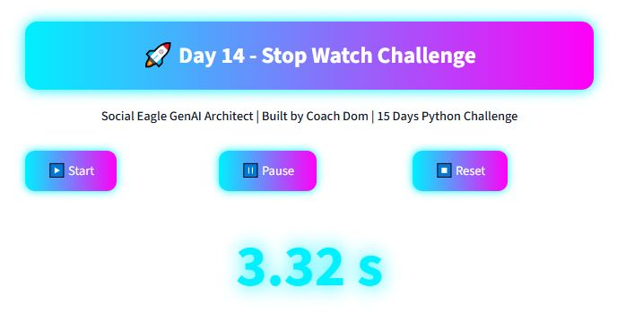
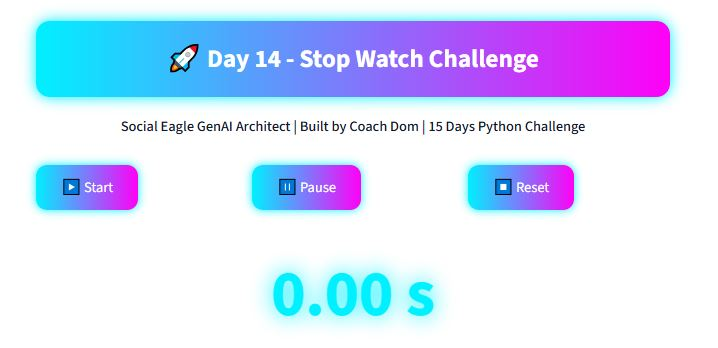

# 🚀 Day 14 – Futuristic Stopwatch App

Welcome to **Day 14** of the **15 Days Python Challenge** 🎉  
This project is a **Streamlit Stopwatch App** designed with a sleek, futuristic UI.

---

## ✨ Features
- ⏱️ Start, Pause, and Reset functionality  
- ✨ Neon cyberpunk-inspired colors  
- 🌌 Modern glowing header & time display  
- 🧑‍🏫 Context-aware design (Coach Dom’s style!)  

---

## 📸 Screenshots

### Stopwatch Running


### Game Over / Reset


---

## ▶️ How to Run

1. Activate your virtual environment (if using one):
   ```bash
   .\venv\Scripts\activate

