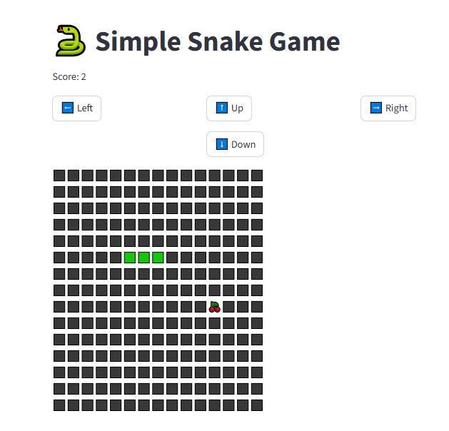

# 🚀 Day 15 – Final Challenge Project

Welcome to **Day 15** of the **15 Days Python Challenge** 🎉 
This is the grand finale project — tying together everything we’ve learned!

---

## ✨ Features
- 🎯 Demonstrates concepts from earlier challenges
- 🖥️ Interactive Streamlit UI
- 🌌 Futuristic design with neon styling
- 📸 Screenshots included

---

## 📸 Screenshots

### Example View


---

## ▶️ How to Run

1. Activate your virtual environment:
   ```bash
   .\venv\Scripts\activate
