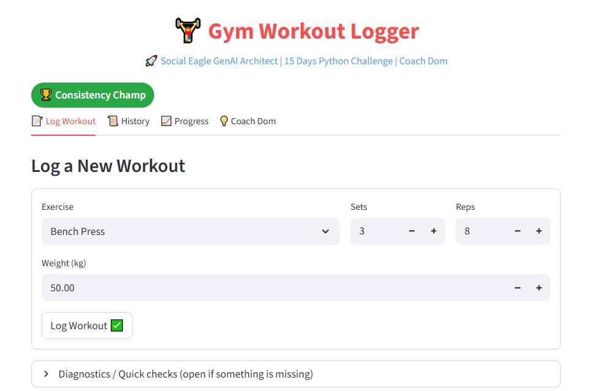
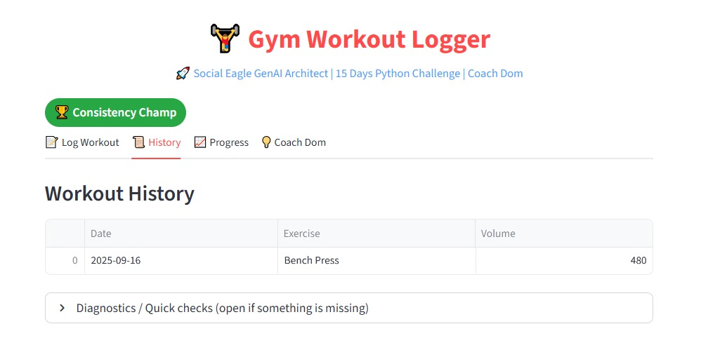
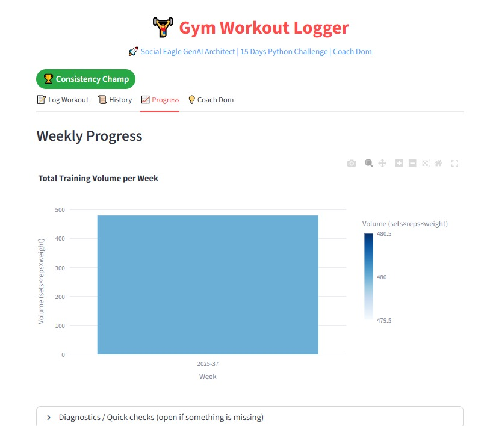
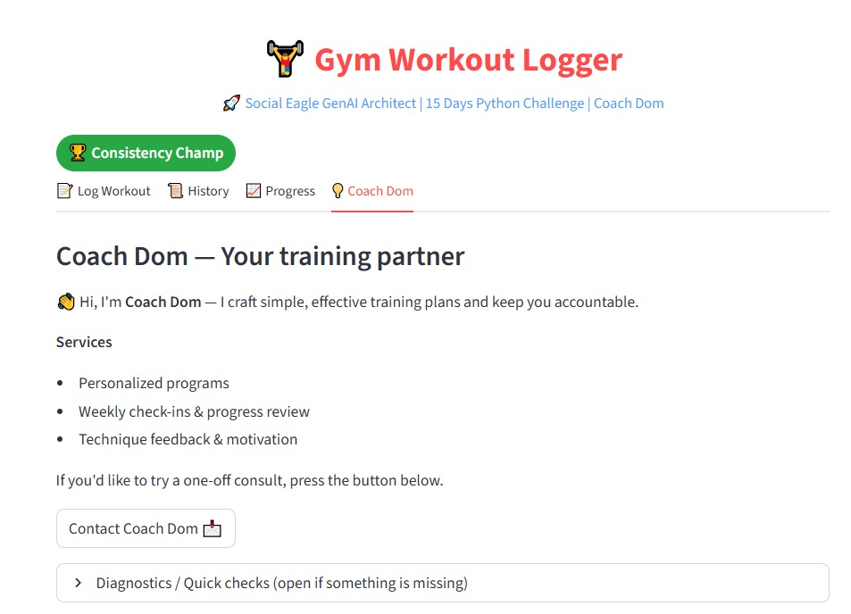

# 🏋️ Day 7 - Python Challenge

## 🚀 App Preview

Here’s how the Day 7 Gym Workout Logger looks:

This project is part of the **15 Days Python Challenge**.  
It’s a **Gym Workout Logger App** built with **Streamlit** to track workouts, visualize progress, and stay motivated.

---

## 🚀 Features
- Log exercises (sets, reps, weights)  
- Store workout data in **SQLite database**  
- View workout history in a table  
- See weekly progress in interactive charts  
- Motivational badges with cycling animations 🎉

---

## 📂 Project Structure

