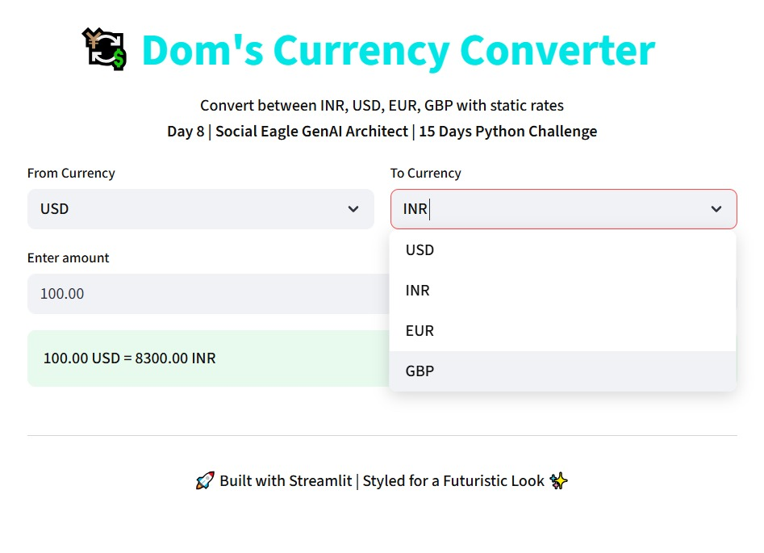

# Day 8 – Currency Converter 💱

This is my **Day 8 Assignment** for the  
**Social Eagle GenAI Architect | 15 Days Python Challenge | Coach Dom** 🚀

---

## 📌 About
A simple **Currency Converter** built with Streamlit.  
- Converts between **INR, USD, EUR, GBP**  
- Uses **static exchange rates**  
- Clean futuristic design ✨  
- Supports two decimal places  

---

## 📸 Demo Screenshot



---

## ▶️ Run the App

If your file is saved as **`app.py`**, run:

```bash
streamlit run app.py


