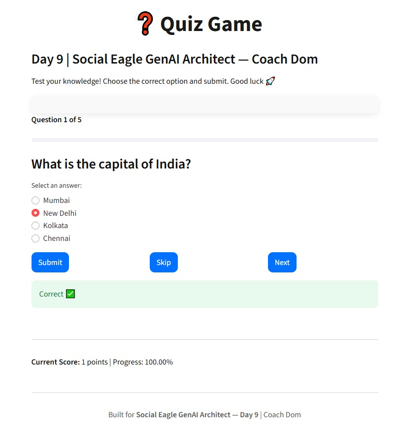

# Day 9 – Quiz Game App ❓  
**Social Eagle GenAI Architect | 15 Days Python Challenge**  
Coach Dom  

---

## 📌 About the App
This is a simple **Quiz Game App** built using **Python + Streamlit**.  
- Multiple-choice questions (hardcoded in Python list/dict)  
- User selects answers with radio buttons  
- Keeps score using `st.session_state`  
- Final score shown with percentage (two decimal points)  
- Clean white background for readability 🎨  

---

## 📸 Screenshot


---

## ▶️ How to Run
1. Clone this repo:
   ```bash
   git clone https://github.com/infolangitcerah-stack/Day-9-python-challenge.git
