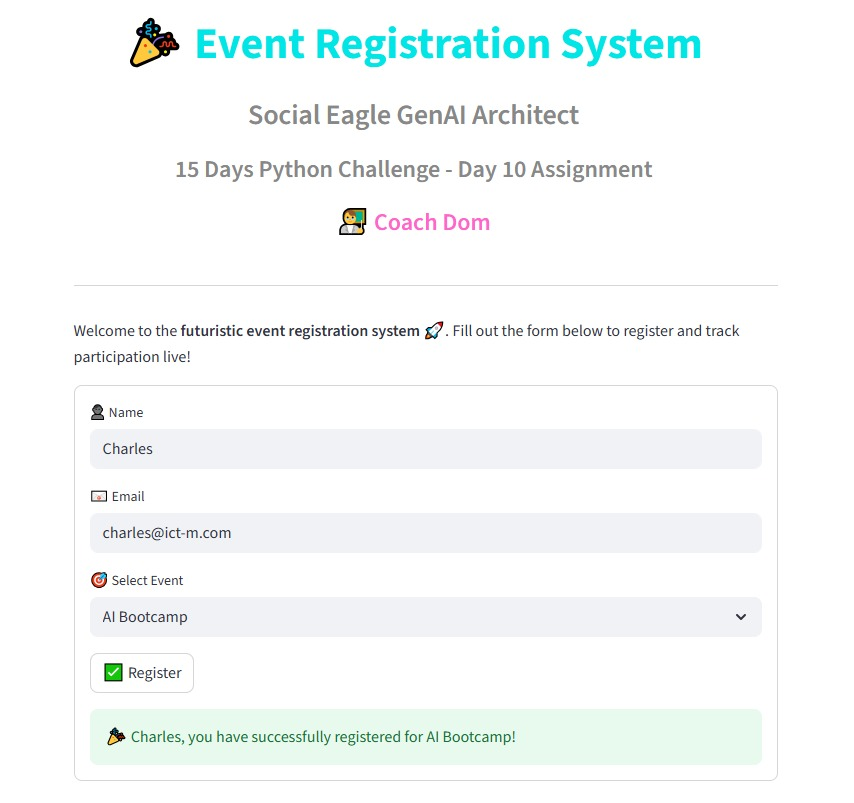
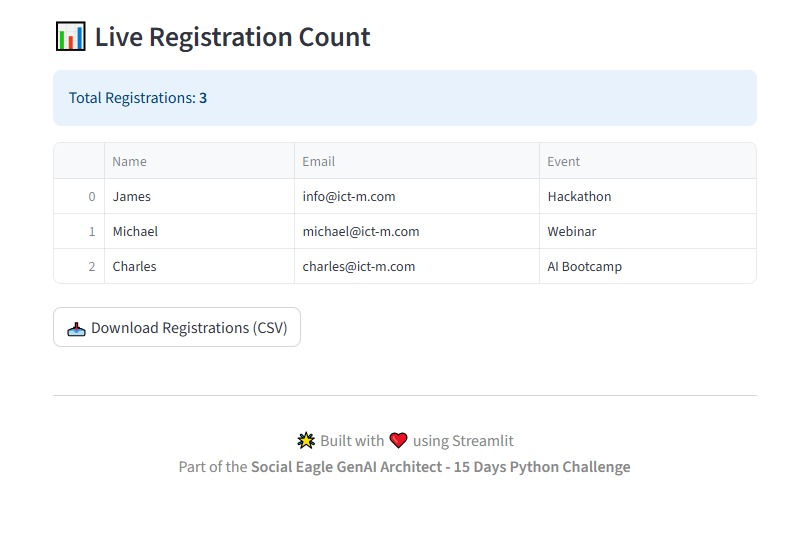

# Day 10 – Python Challenge

This project is part of my **15 Days Python Challenge** with Coach Dom 🚀  

---

## Screenshots

### Day 10


### Day 10 (second run)


---

## How to Run
1. Clone the repo  
2. Navigate to the **Day-10** folder  
3. Run the app with:
   ```bash
   streamlit run day10_app.py
