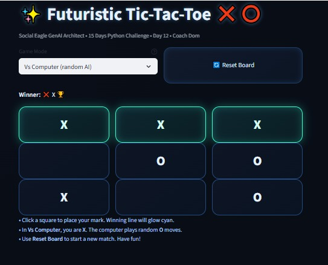

# 🎮 Futuristic Tic-Tac-Toe ❌⭕

**Context:**  
- Social Eagle GenAI Architect  
- 15 Days Python Challenge  
- Day 12 Assignment  
- Coach Dom  

---

## 📌 Features
- 3×3 grid with glowing futuristic buttons  
- Two-player mode or vs computer (random AI)  
- Winning line highlight ✨  
- Reset button to restart the game  
- Neon, modern design  

---

## 📸 Screenshot
Here’s how the app looks:



---

## ▶️ How to Run
1. Open terminal inside **Day-12** folder.  
2. Activate your venv.  
3. Run:
   ```bash
   streamlit run day12_app.py

✅ Notes

Player ❌ always starts first.

In Vs Computer mode, you play ❌ and the computer plays ⭕ randomly.

Winning tiles glow to celebrate the victory 🏆.

Reset anytime with the 🔄 Reset Board button.