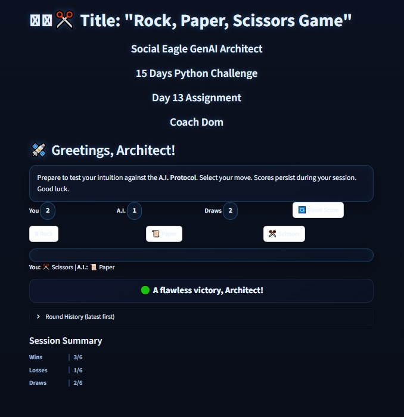

# 🪨📜✂️ Rock, Paper, Scissors Game  

## Context  
- **Social Eagle GenAI Architect**  
- **15 Days Python Challenge**  
- **Day 13 Assignment**  
- **Coach Dom**  

---

## 🚀 About the Project  
This is an interactive **Rock, Paper, Scissors Game** built with **Python + Streamlit**.  
The user competes against the computer, with persistent scores tracked during the session.  
The design uses a **neo-cyberpunk / holographic theme** with glowing UI elements for a futuristic feel.  

---

## 🎮 Features  
- User vs Computer gameplay with standard RPS rules.  
- Persistent scoring using `st.session_state`.  
- **Reset Score** button to restart anytime.  
- **Round history** (last 10 rounds).  
- Dynamic outcome feedback (Win, Lose, Draw).  
- **Session summary bar chart** after 5+ rounds.  
- Responsive UI with vibrant neon styling.  

---

## 🖼️ Screenshot  
  

---

## 🛠️ How to Run  

1. Clone the repo:  
   ```bash
   git clone https://github.com/infolangitcerah-stack/Day-13-python-challenge.git
   cd Day-13-python-challenge

   📚 Learning Goals

This challenge focuses on:

Using Streamlit state management (st.session_state).

Applying custom CSS for UI/UX.

Structuring code with reusable functions.

Creating a gamified user experience with visual feedback.
